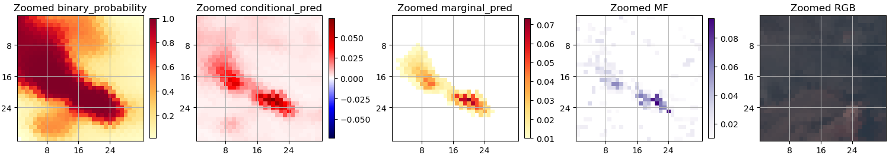
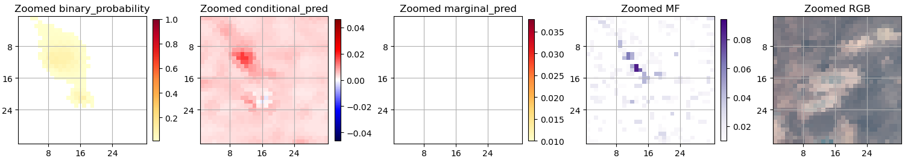

# Hyperspectral

### What are the key differences between the training data and model for multispectral data (Sentinel 2\) and hyperspectral data (EMIT)?

EMIT dataset generation generally followed the same pattern as Sentinel-2 and Landsat 8/9.
EMIT granules were sampled globally for the training split, with the validation split stratified across three oil producing regions:

1. the Permian Basin (operationally relevant),
2. Colorado (difficult background, analogous to the Marcellus region used for the other satellites), and
3. North Africa (easy background).

More details on regional stratification are given in [Validation](Validation.md).

Some 1,120 granules were used for the training split and 199 for validation.
The granules themselves were tiled into 128×128 pixel crops.
Into these we synthetically inserted plumes identified by the EMIT and AVIRIS sensors.
We drew from a set of 2,544 plumes for the training chips and 636 for validation, with plumes reused across their respective splits.
Spatial transformations were applied to the plumes, but in contrast to the datasets of the other satellites there was no modulation of plume concentration.

Another important difference in the EMIT dataset is that no temporal reference imagery is used either for training or inference.
That is described in greater detail in the following section.

### Which of the spectral bands do you use?

We have opted to use all 285 of EMIT's spectral bands. This is different from the choice made in Růžička et al. (2025) for a similar model, where they only use 86 bands in the methane-absorbing part of the spectrum. This is informed by our experience with Sentinel 2, where bands outside of the methane-absorbing regions are essential to filter out false positives. Our understanding is that they act as controls – if a candidate methane plume has a corresponding morphological signature detectable outside of the methane-absorbing region, then it must be a false positive. However, for hyperspectral data, we have not experimentally validated the hypothesis that providing the additional bands results in better performance.

### Have you tried training a hyperspectral model with reference scenes?

For a number of reasons, we have not tried training a hyperspectral model with reference scenes.
EMIT has a fine spectral resolution making it well suited to the problem of methane detection, whereas Sentinel-2 and Landsat 8/9 each have two broad bands covering methane-absorbing spectra.
This suggests that a machine learning approach using a single acquisition is possible for EMIT while historical reference imagery is necessary to draw out the methane signal for the other satellites.
Additionally, EMIT has sparse historical coverage compared to the other satellites, meaning that high quality reference scenes may not be available for a given location or they are likely to be further removed in time.
Finally, poor reference scenes can frustrate inference; the presence of unmasked clouds or an emissions event in reference imagery can cause incorrect predictions, particularly false negatives.
Given this, we decided to approach the methane detection problem using a single scene (monotemporal imagery) in the case of EMIT rather than try to leverage reference imagery

### Results and limitations

The EMIT CV model achieved the following scores on the validation set:

* F1 score: 0.720
* Recall: 0.584
* Precision: 0.938
* Mean squared error: 0.099

Given that the validation set had been created by synthetically inserting plumes, we put particular weight on qualitatively evaluating an additional set of 61 known emissions identified by IMEO in their original granules, *i.e.* without having been synthetically inserted.
As a comparison baseline we used the matched filter (MF) algorithm implementation [mag1c](https://github.com/markusfoote/mag1c) by Foote *et al*.
The EMIT CV model successfully detected the vast majority of these emissions events.
False negatives generally correlated with at least one of the following criteria: difficult image background, low methane concentrations, or, particularly, spatially small or sparse methane-containing pixels.
An example of a true positive and a false negative are shown below.

*Figure: Example of a true positive detection by the EMIT CV model.*

*Figure: Example of a false negative detection by the EMIT CV model.*

The finding that the model misses a number of small or sparse plumes suggests that changes to the [loss function](Model.md#what-is-the-loss-function-used-for-training) could allow for an improved model.
The mean squared error portion of the model is relatively insensitive to errors of a few pixels.
For larger plumes this makes sense: missing only a few pixels would often be considered good enough.
However, entirely missing a small plume of a few pixels is more problematic from an operational perspective given that recall is of utmost importance, especially given that at the EMIT resolution of 60 meters, small plumes will be a regular occurrence.
Tweaking the loss function to account for this could be promising but has not yet been tested.

### Does the EMIT CV model outperform the matched filter?

It would be difficult to assert that one method is outright better than the other.
From the evaluation of IMEO notified plumes, the matched filter does identify methane in a number of cases where the EMIT CV model either predicts with very low confidence or misses the methane altogether.
As discussed above, these are generally cases of very small or sparse plumes.

The matched filter results contain considerable noise, which we have frequently found to frustrate the automatic segmentation of plumes.
The EMIT CV model produces results with a much higher signal-to-noise ratio, making them easier to segment automatically.

Given the advantages of each approach, the matched filter is still better suited to cases where manual review and segmentation are feasible.
This will be over smaller amounts of imagery.
For large-scale processing and automatic plume segmentation, the clean outputs of the EMIT CV model are preferable even if this will result in lower recall.

### References

Foote, M. D., *et al.* "Fast and Accurate Retrieval of Methane Concentration from Imaging Spectrometer Data Using Sparsity Prior" IEEE Transactions on Geoscience and Remote Sensing. 2020\.

Růžička, Vít, and Andrew Markham. "HyperspectralViTs: General Hyperspectral Models for On-board Remote Sensing." *IEEE Journal of Selected Topics in Applied Earth Observations and Remote Sensing* (2025).

