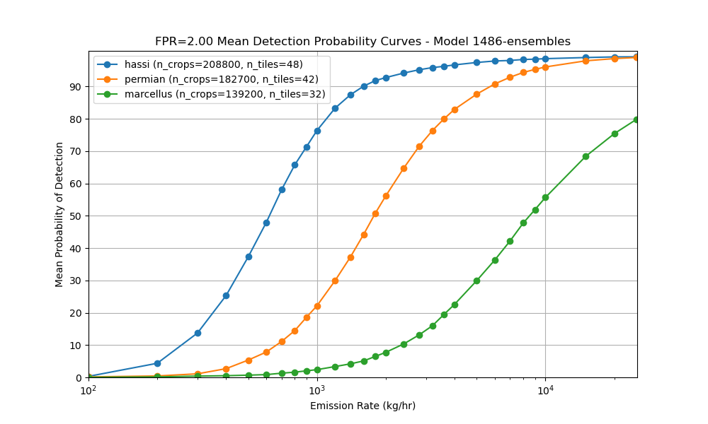

# Landsat

### Can you apply the Sentinel-2 model without retraining on Landsat data?

Yes — we’ve experimented with applying our Sentinel-2 model directly to Landsat imagery using the same [simulated plume insertion](Data.md#how-do-you-simulate-methane-plumes) and [frac prediction approach](Data.md#what-is-the-input-to-the-neural-network). However, the results were suboptimal. While it *technically* works, the performance drops due to differences in resolution, sensor characteristics, and spectral coverage between Sentinel-2 and Landsat.

To address this, we trained a dedicated model on Landsat data using the same methodology. This led to significantly better performance.

### What are the results of your best Landsat model?

Below are the detection threshold results for the Landsat model (corresponding to an average FPR of around 1.3 plumes per 352×352 tile—area-equivalent to 500×500 px tiles in Sentinel-2):

**Hassi (Algeria)**

* We detect emissions of 177 kg/hr in 10% of cases
* 50% DT: 481 kg/hr
* 90% DT: 2287 kg/hr

**Permian (USA)**

* 10% DT:  552 kg/hr
* 50% DT: 1835 kg/hr
* 90% DT: 10,350 kg/hr

**Marcellus (USA)**

* 10% DT: 2064 kg/hr
* 50% DT: 8583 kg/hr
* 90% DT: \>25000 kg/hr

Interestingly, the Landsat model achieves **better 10% and 50% detection thresholds** than our [current Sentinel-2 model](Validation.md#what-are-the-results-of-your-best-model), though **90% thresholds are worse**—likely due to differences in signal-to-noise characteristics and scene variability.

This result highlights the value of training sensor-specific models, rather than relying on direct transfer from one platform to another.

### What are the differences between the approach used for Sentinel-2 and Landsat?

The main difference lies in how the data is generated and ingested. Landsat and Sentinel-2 differ in spatial resolution, tiling format, and metadata structure, which impacts how we process and align scenes for methane detection.

#### Sensor Coverage and Temporal Depth

We use only Landsat 8 and 9 because they are the two active missions still collecting data, which makes them suitable for real-time methane monitoring. Landsat 8 also gives us a longer history, with data available since 2013—earlier than Sentinel-2, which started in 2016\.

#### Spatial Resolution

**Sentinel-2** has 20m resolution, **Landsat** has 30m (in the relevant methane absorbing bands).

#### Tiling Alignment

* **Sentinel-2** is naturally organized in fixed **MGRS tiles** (100 km × 100 km), which makes spatial alignment straightforward and consistent across time.
* **Landsat** images are delivered as **WRS-2 path/row scenes**, which are not aligned to a fixed grid. This introduces spatial variability across acquisitions and makes it harder to stack and compare scenes directly.

To address this, we implemented a **fixed internal tile grid** for Landsat (e.g. 384×384 pixel tiles) and reprojected each Landsat acquisition to this grid, enabling consistent spatial alignment across time and scenes.

#### Reference Scenes Alignment

Creating a time series stack of reference scenes for Sentinel-2 is straightforward— the scenes are already orthorectified, snapped to a global UTM-based grid (MGRS), and aligned at the pixel level. Each scene is delivered in a consistent spatial reference system, so time steps are co-registered by default. That means we can compare across dates directly, without worrying about reprojection artifacts or pixel shifts.

Landsat, on the other hand, follows the WRS-2 path/row system. Each scene covers a full swath and isn’t aligned to a consistent global tiling grid. Even though the data is orthorectified, there’s no guarantee that pixels line up across dates. So for Landsat, we have to reproject all reference scenes to the grid of the main (target) scene to do a time series analysis.

#### Cloud Masking

For Sentinel-2, we use an external model (**OmniCloud**) to generate high-quality cloud masks. For Landsat, we found the native QA\_PIXEL band sufficient to exclude invalid pixels (cloud, shadow, etc).

#