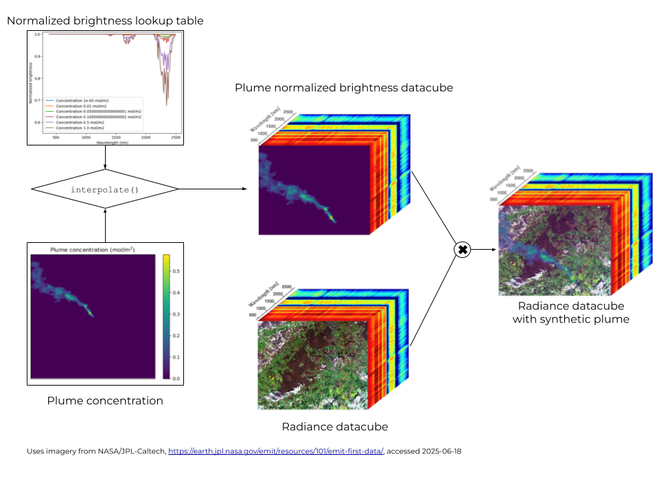

# Radiative Transfer

### What is the model of radiative transfer that you use?

Initially at Orbio we relied on a conventional multilayer radiative-transfer solver. Although such models are physically exact, running it for tens of millions of pixels needed in our synthetic-data pipeline became a hurdle. We therefore built a single-pass radiative transfer approximation that: (a) preserves the physics that matters for methane retrieval, (b) drops or simplifies the terms that are expensive to compute, but have negligible impact on retrieval accuracy. Due to the modular nature of the model, we can drop approximations one by one, trading off the speed for the accuracy of the model.

### How do we model the Top of Atmosphere (TOA) signal?

In our model, similarly to other models we consider the TOA signal coming from the sunlight doubly passing through the atmosphere and reflecting off the surface of the earth. This can be modelled by considering the intensity recorded at the TOA, at the wavelength $\lambda$

$$
I_\lambda^{\text{TOA}}
      = I_\lambda^{\text{sun}}\,
        r_\lambda\,
        \alpha_\lambda\,
        \exp\!\Bigl[-\!\int_0^{\infty} k_\lambda(s')\,ds'\Bigr].
$$

, where
- $I_\lambda^{\text{sun}}$ - solar irradiance (Clough et al., 2005).
- $r_\lambda$ – aerosol scattering factor (slowly varying with wavelength).
- $\alpha_\lambda$ – surface bidirectional reflectance (albedo).
- $k_\lambda$ – aggregate volume-absorption coefficient of all gases.

A multispectral detector does not see the monochromatic spectrum; each band $b$ integrates the intensity through its spectral response function $f_\lambda^{b}$:

$$
I^{b}=\int f_\lambda^{b}\,I_\lambda^{\text{TOA}}\;d\lambda .
$$
It is worth noting here that predicting the exact TOA radiance is nearly an impossible task. Surface spectrum, aerosol load, and vertical gas profiles are poorly known on a per-pixel basis. Therefore we focus instead on a differential observable $nB$. Taking the ratio between the measured band radiance and the hypothetical methane-free radiance removes the first order dependence on the values of the parameters.

$$
nB = \frac{I^{b}}{I^{b}_{0}}
     =\int \widehat n^{b}_{\lambda}\;
       \exp\!\Bigl[-\!\int_0^{\infty}
            k^{(\Delta CH_4)}_{\lambda}(s')\,ds'\Bigr] d\lambda .
$$

, where $k^{(\Delta CH_4)}_{\lambda}(s')$ is the aggregate volume absorption coefficient in the hypothetical methane free scenario. $\widehat n^{b}_{\lambda}$ defined as below

$$
\widehat n^{b}_{\lambda}
   =\frac{f^{b}_{\lambda}\,I_\lambda^{\text{sun}}\,r_\lambda\alpha_\lambda
          \exp[-\!\int k^0_\lambda ds']}
         {\int f^{b}_{\lambda'}\,I_{\lambda'}^{\text{sun}}\,r_{\lambda'}\alpha_{\lambda'}
          \exp[-\!\int k^0_{\lambda'} ds']\,d\lambda'} .
$$
Because the same unknowns appear in numerator and denominator, the ratio $nB$ is first-order insensitive to errors in surface albedo, aerosol optical depth, and background gas profiles. $\widehat n^{b}_{\lambda}$ functions as a wavelength-dependent weighting mask that tells us which parts of the methane absorption spectrum dominate the band signal.

### So what is lightweight about your calculation?

A formal error budget showed that one of the dominant uncertainties (20%) in full multilayer radiative transfer model of the differential signal comes from the ignorance of surface reflectance spectrum, not from the fine details of atmospheric propagation. This is fundamentally very difficult to know a priori. By accepting that there exist an error floor and simplifying everything that contributes less than it, we cut runtime by *two orders of magnitude* while keeping total retrieval error within the same 20% envelope.

Making these simplifications, we treat the entire atmosphere as a single slab at 300 K and 1 bar. Absorptivities for CH₄, CO₂, H₂O, and the other relevant gases are taken from the HITRAN database at those conditions, while the background column densities follow the U.S. Standard Atmosphere (1976) scaled to present-day values (about 421 ppm CO₂ and 1900 ppb CH₄).

Because the model uses a single slab, the altitude dependence of the absorption coefficients is ignored; the same coefficients act uniformly from the surface to the top of the atmosphere, so no layer-by-layer integration is required.

We also omit explicit treatment of surface albedo and the slow aerosol spectral slope. Both vary only gently across the SWIR methane windows and together dominate the irreducible 20% uncertainty that already limits the retrieval. Their combined effect is carried as a fixed term in the error budget.

Finally, the global filter functions $\\widehat n^{b}\_{\\lambda}$ are pre-computed offline and stored with the code, so a run-time evaluation reduces to a quick dot product plus a lookup in the methane cross-section table.

If future work reduces the albedo uncertainty, the framework lets you dial the radiative transfer fidelity back up and reclaim those accuracy gains

### How do we impute the data into the synthetic data?

To inject synthetic methane plumes into a scene we proceed as follows. First, we generate a lookup table that gives the global-filter factor $nB$ for each band as a function of the excess methane column $\\Delta X\_{CH\_4}$ value to build an n-dimensional array of attenuation factors \- our “plume-normalised brightness” data cube. Finally, we obtain the synthetic-plume radiance cube simply by multiplying this attenuation cube element-wise with the original radiance cube of the methane-free scene. This is visualised in the diagram below.

### 

###

###