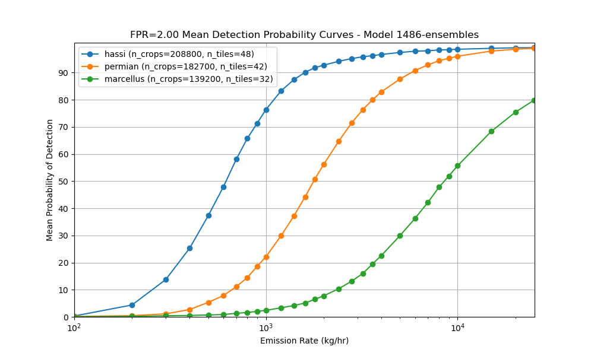

# Validation

### How do you assess model performance?

We assess model performance through a combination of synthetic plumes, ground truth emissions, and metrics tailored to production constraints, such as the [detection threshold](Validation.md#how-do-you-estimate-the-detection-threshold-of-your-model). These constraints reflect the trade-off we face in production between high detection sensitivity and keeping false positives low enough to avoid overwhelming downstream QA and users.

During training, we minimize a custom loss function that balances methane detection (via binary classification) and quantification (via conditional regression). See [here](Model.md#what-is-the-loss-function-used-for-training) for more details on the loss function. The [validation dataset](Data.md#how-was-the-validation-dataset-created) consists of synthetic plumes injected into real satellite scenes across three representative regions: [Hassi/Permian/Marcellus](Validation.md#why-have-you-selected-these-three-specific-regions-to-validate-in). At regular intervals during training, we evaluate model performance on this synthetic validation dataset. We select the best checkpoint based on recall, computed at a detection threshold that is tuned to meet a fixed false positive constraint. See [here](Validation.md#what-metrics-do-you-use-during-model-training) for more details.

In addition to synthetic evaluation, we test model performance against a curated list of real world ground truth emission events compiled from various studies, including Varon et al. (2021), IMEO Notified Plumes (reported high-emission events from the UN’s International Methane Emissions Observatory), and SBR field campaigns (Single-Blind Release studies conducted by Stanford that provide known, independently quantified plumes under controlled conditions). These include known plumes with verified emission rates across sites in Algeria, Turkmenistan, the US, and more. Ground truth checks help confirm the model can generalize to real data and not just synthetic proxies.

### What are the results of your best model?
Our best model achieves high sensitivity to methane plumes while maintaining strict false positive controls. Here we summarize the [detection threshold](Validation.md#how-do-you-estimate-the-detection-threshold-of-your-model) (DT) results from synthetic plumes and performance on known true positive cases (ground truth).

#### Detection Threshold Results

The model’s sensitivity varies by geography, reflecting differences in scene noise, terrain, and atmospheric conditions. For each region, we report the emission rate that is detected in 10%, 50%, and 90% of cases (=probability of detection (POD) levels).

**Hassi (Algeria)**

* We detect emissions of 260 kg/hr in 10% of cases
* 50% DT: 620 kg/hr
* 90% DT: 1593 kg/hr

**Permian (USA)**

* 10% DT:  666 kg/hr
* 50% DT: 1776 kg/hr
* 90% DT: 5753 kg/hr

**Marcellus (USA)**

* 10% DT: 2344 kg/hr
* 50% DT: 8535 kg/hr
* 90% DT: \>25000 kg/hr

These thresholds reflect the emission sizes the model can detect at each confidence level, under a controlled false positive rate of 2 FP plumes per 500x500 px area.

These results directly inform the model’s utility in operational settings, by helping users understand the minimum emission rates they can expect the model to reliably capture. In practice, this means that in regions like the Permian, the model is likely to detect most large emitter events but may miss smaller emissions below around 600 kg/h. While in Hassi-like regions, the model is more sensitive and can pick up quite low emissions.

#### Ground Truth Dataset (Single Blind Release) Performance

The model’s performance on ground truth data was also promising. Here we showcase its performance on the Single Blind Release (SBR) site at Casa Grande. From the 2022 and 2024 campaigns, there were 35 controlled events: 13 methane releases and 22 no-release scenes. The model achieved:

* 10 true positives
* 22 true negatives
* 0 false positives
* 3 false negatives

This performance indicates strong real-world detection capability at the Casa Grande site, with high precision and only a few missed detections. The complete absence of false positives is especially promising, suggesting good robustness to background noise in clean scenes. However, the three missed plumes highlight that lower-emission or visually subtle releases can still be challenging under certain conditions. Below, we show three representative examples to illustrate these outcomes:

This is an example of a **high confidence true positive**, where the model cleanly detects the release. The expected emission rate was 1358 kg/hr and we quantified 1509 kg/hr.

This is an example of another **true positive but with nearby false positives**. The actual emission was 628 kg/hr, we detected 900 kg/hr.

Lastly, this is an example of a **missed detection**. Although this was a medium sized emission event (763 kg/hr), our model was not able to pick it up. This could be explained by the fact there is a slight haze over the emission site, which hinders the model’s ability to detect.

### Why have you selected these three specific regions to validate in?
These regions allow us to evaluate our model’s generalizability and false positive rate (FPR) performance under varying environmental conditions, specifically in areas we actively run our models (major oil and gas producing areas). Each region maps to a distinct Signal-to-Noise Ratio (SNR) tier, allowing us to benchmark model behavior across easy, medium, and hard detection settings.

**Tier 1: Easy — Hassi Messaoud (Algeria)**

* **Environment:** Desert-like, minimal vegetation
* **Rationale:** This region offers high SNR conditions that are ideal for detecting methane. It serves as a “best-case” environment, allowing us to establish a baseline FPR under clean, low-noise conditions

**Tier 2: Medium — Permian Basin (USA)**

* Environment: Mixed vegetation, brush, sparse vegetation
* Rationale: The Permian is a high-emission oil and gas region with moderate background complexity and reflectance  It represents a moderate SNR — realistic for detection but still prone to moderate false positives

**Tier 3: Hard — Marcellus Shale (USA)**

* **Environment:** Forested, agricultural, hilly terrain
* **Rationale:** Marcellus provides the most challenging conditions for methane detection due to its low SNR and complex backgrounds. It defines the model’s worst-case false positive behavior and sets realistic expectations for performance in difficult scenes. Validating in this region stress-tests our model’s robustness

### What metrics do you use during model training?
As the main validation metric, we selected average Recall over multiple emission buckets and averaged over the three regions [Hassi/Permian/Marcellus](Validation.md#why-have-you-selected-these-three-specific-regions-to-validate-in). Recall is calculated using a classification threshold that allows for 10 false positive pixels on average over all 128x128 validation crops.

Balancing False Positives and Recall allows us to select the model that offers the highest sensitivity (i.e. best detection accuracy) without exceeding our target noise tolerance. We have found that performance of the regression part of the model correlates highly with the performance of the binary part of the model. See [here](https://github.com/Orbio-Earth/Eucalyptus-code-archive/blob/main/methane-cv/src/training/training_script.py#L1378) for the implementation of validation.

We also output metric visualizations after each validation epoch. The False Positive Px Rate Curves show the Likelihood threshold (which is the binary threshold \* 10\) that was selected to give 10px on average over all validation chips and all three regions.
Given this threshold, we calculate the Recall (Detection Probability) for different emission rate buckets for the three regions. Averaging over emission rates and regions gives us the final average Recall value we track for overall performance.

For the below example we get:

mAvgRecall: 42.7% (Hassi: 72.9%, Marcellus: 10.8%, Permian: 44.4%)

### How do you estimate the detection threshold of your model?
To get to an answer to the question “we can detect plumes of X kg/hr in Y% of cases” we developed the following detection threshold method, which we run on models we want to release to production. This method is approximated during training as described [here](Validation.md#what-metrics-do-you-use-during-model-training).

We have a dataset of simulated methane plumes produced by Gorroño et al. (2023) using large eddy simulations. For each plume, there is a raster of concentration, and a flow rate at the source. We can scale a plume up and down as the concentrations are proportional to the flow rate.

Using this, taking a single plume in a single scene, we can insert a plume with a known emission rate into the target scene, and see if a model can detect it. The computer vision models return a likelihood score, so rather than a yes or no answer, we can look at the likelihood score (more precisely: the maximum of the likelihood score within the footprint of the plume) as the plume gets stronger. We can produce a graph that looks like this.

Taking this one step further, still for a single tile or crop, we can use all of the simulations we have, and randomly move and rotate them around the scene, still with a range of intensities. Imagine getting hundreds of curves like the one above. We can then start making probabilistic statements about detections in this scene. If we choose a likelihood score threshold for detections (say, we accept all plumes above 4/10), then we can calculate the percentage of detections for every plume size. We can now make statements like "a plume of size 1,500 kg/hr would have a 40% probability of being detected by our model near this asset on this date." Graphically, it would look something like:
For any choice of detection threshold, we get a different curve. We can put all of them on the same graph. This is still for a single site on one date.The last step is to repeat this exercise for an entire area of interest (e.g. the Permian basin), select a Likelihood Score that yields an acceptable number of False Positives and to report the emission rates we can detect in 10%/50%/90% of cases.
For finding the Likelihood Score with an acceptable number of False Positive plume detections, we can run the model over many chips without methane and plot the relationship between Threshold (= used interchangeably with Likelihood Score, LS is just scaled to lie between 0-10 whereas Threshold/Marker Threshold lie between 0-1) and average False Positive plumes (connected plume objects, not pixels). Below, this was normalized to produce an average of 2 False Positive plumes averaged over the three regions per 500x500 px tile, because we used 500x500 px tiles in production.

The magenta line at FP=2 gives us a Likelihood Threshold of 3.044 which we can use to create our final mean Detection Curves.

For Hassi, we detect emissions of 260 kg/h in 10% of cases, 620 kg/h in 50% and 1593 kg/h in 90%.
For Permian, we detect emissions of 666 kg/h in 10% of cases, 1776 kg/h in 50% and 5753 kg/h in 90%.
For Marcellus, we detect emissions of 2344 kg/h in 10% of cases, 8535 kg/h in 50% and \>25000 kg/h in 90%.

### Does strong performance on real world test data (e.g. ground truth plumes) mean the model is ready for production?

Not necessarily.

Methane detection in satellite imagery is fundamentally difficult. Plumes can be faint, variable, and easily confounded by clouds, terrain, haze, and sensor noise. Even when the model performs well on real emission events, this doesn’t guarantee readiness for automated, wide-scale deployment—especially given how limited and noisy real ground truth data typically is.

Single Blind Release (SBR) studies offer a rigorous benchmark: methane is released at known times and rates while modelers remain blinded, allowing for objective validation against high confidence ground truth data. These studies typically occur in clean desert environments, which reduces ambiguity from vegetation. But even under these favourable conditions, models can fail to detect low rate emissions or struggle with false positives. This highlights just how sensitive and error-prone the detection task can be.

Moreover, production use requires much more than success on curated cases. The model must:

* Operate across millions of diverse, uncurated scenes with no prior hints of where emissions may occur
* Generalize across regions, seasons, and image quality
* Maintain strict false positive controls to avoid overwhelming QA

That’s why strong performance on real-world test cases like SBRs is necessary—but not sufficient. We supplement them with synthetic plumes, regional validation datasets, and controlled FPR benchmarking to assess model reliability under realistic, scalable operational conditions.

## References

Gorroño, Javier, Daniel J. Varon, Itziar Irakulis-Loitxate, and Luis Guanter. "Understanding the potential of Sentinel-2 for monitoring methane point emissions." *Atmospheric Measurement Techniques* 16, no. 1 (2023): 89-107.

Varon, Daniel J., Daniel J. Jacob, Jason McKeever, Dylan Jervis, Berke OA Durak, Yan Xia, and Yi Huang. "Quantifying methane point sources from fine-scale satellite observations of atmospheric methane plumes." *Atmospheric Measurement Techniques* 11, no. 10 (2018): 5673-5686.

Varon, Daniel J., Dylan Jervis, Jason McKeever, Ian Spence, David Gains, and Daniel J. Jacob. "High-frequency monitoring of anomalous methane point sources with multispectral Sentinel-2 satellite observations." *Atmospheric Measurement Techniques* 14, no. 4 (2021).